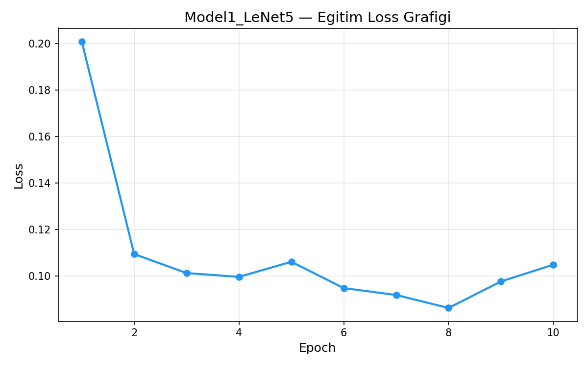
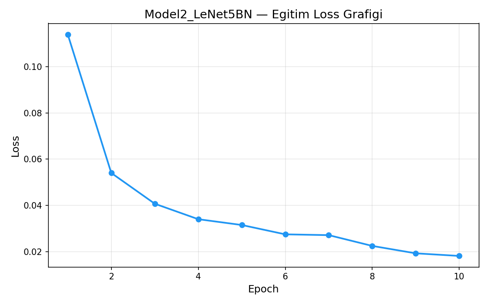
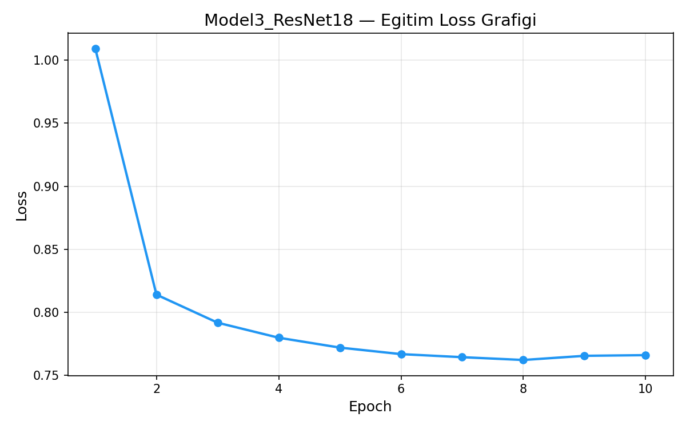
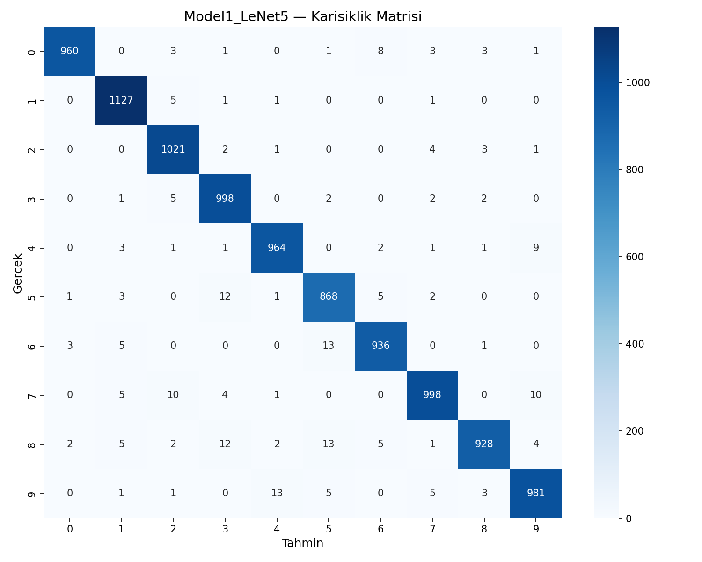
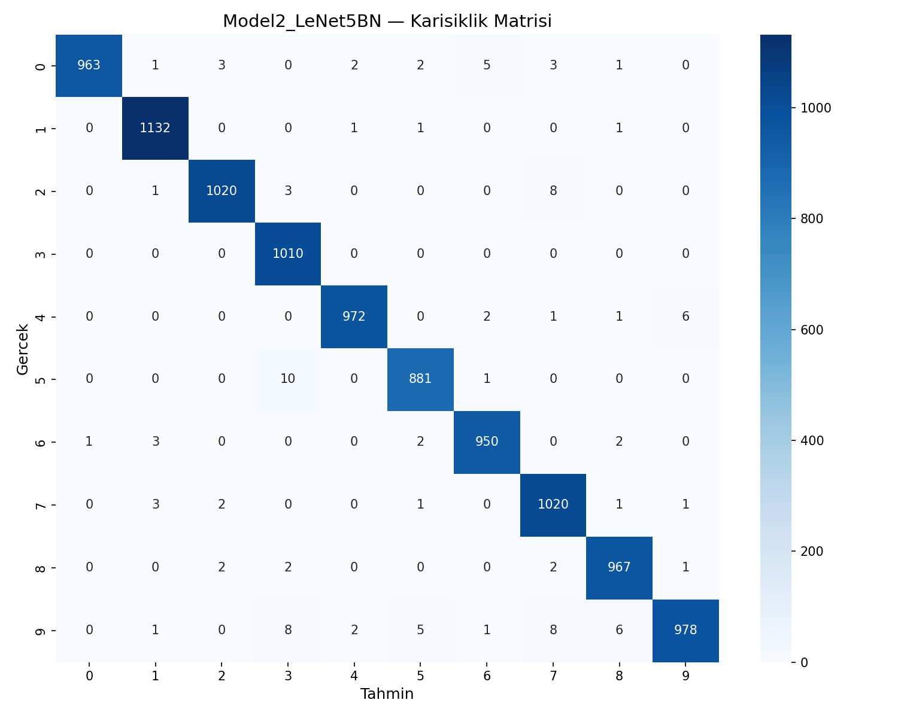
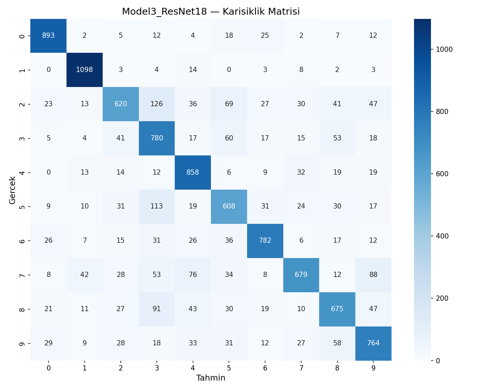
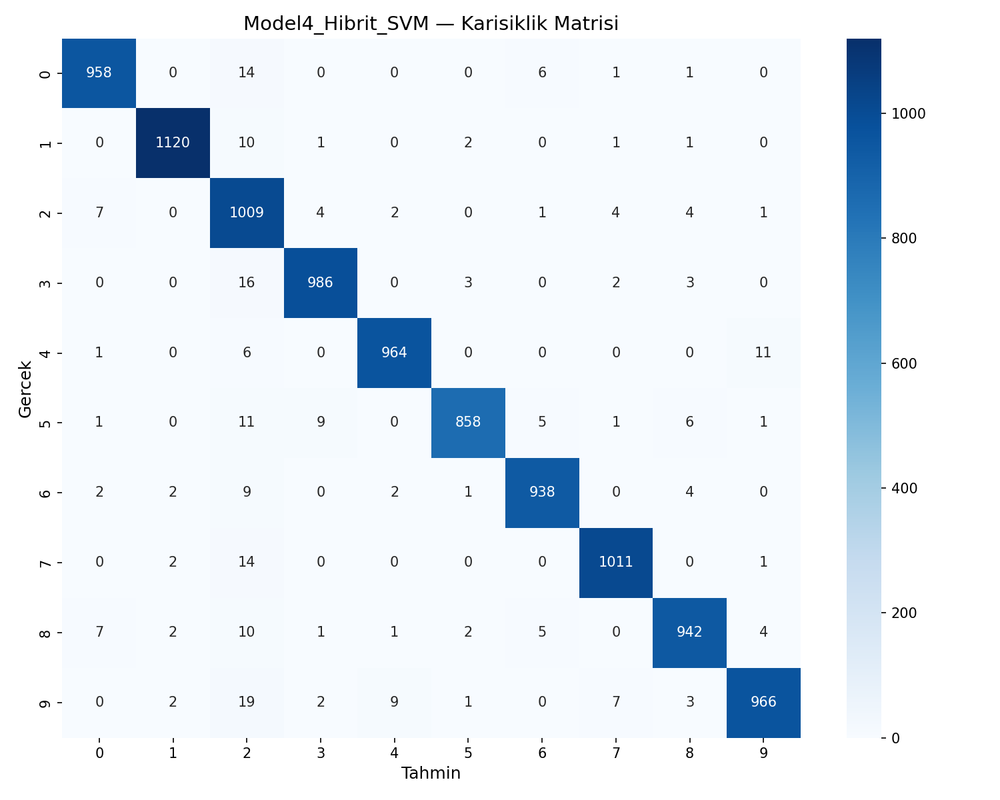

# YZM304 Derin Öğrenme — I. Proje Modülü II. Proje Ödevi

**Ankara Üniversitesi — Yapay Zeka ve Veri Mühendisliği Bölümü**  
**2025–2026 Bahar Dönemi**

---

## 1. Giriş (Introduction)

Bu projede, evrişimli sinir ağları (CNN) kullanarak görüntü sınıflandırma problemi üzerinde farklı model mimarileri karşılaştırılmıştır. Çalışma kapsamında **MNIST el yazısı rakam veri seti** kullanılarak 4 farklı yaklaşım denenmiş ve sonuçları analiz edilmiştir.

### 1.1 Problem Tanımı
MNIST veri seti, 0-9 arası rakamların 28×28 piksel gri tonlamalı görüntülerinden oluşmaktadır. Amaç, bu görüntülerin doğru rakam sınıfına otomatik olarak sınıflandırılmasıdır.

### 1.2 Veri Seti
| Özellik | Değer |
|---------|-------|
| **Eğitim Seti** | 60.000 görüntü |
| **Test Seti** | 10.000 görüntü |
| **Görüntü Boyutu** | 1 × 32 × 32 (2 piksel padding ile) |
| **Sınıf Sayısı** | 10 (0-9 rakamları) |
| **Normalizasyon** | mean=0.5, std=0.5 → [-1, 1] aralığı |

### 1.3 Ön İşleme
- **Padding:** 28×28 → 32×32 (LeNet-5 mimari uyumluluğu için 2 piksel padding)
- **Normalizasyon:** Piksel değerleri [0, 1]'den [-1, 1] aralığına dönüştürülmüştür
- **Kanal Çoğaltma (Model 3):** 1 kanal → 3 kanal (pretrained model uyumluluğu için)

---

## 2. Yöntem (Method)

### 2.1 Model 1 — LeNet-5 (Temel Model)
LeCun ve ark. (1998) tarafından önerilen LeNet-5 mimarisi temel alınmıştır. Modelin akışı:

```
Input(1×32×32) → C1[Conv2d(1,6,5)+ReLU+MaxPool] → C2_1 + C2_2 [Residual]
→ C3[Conv2d(16,120,5)+ReLU] → Flatten → F4[Linear(120,84)+ReLU] → F5[Linear(84,10)+LogSoftmax]
```

**Özellikler:**
- C2 katmanında **residual bağlantı** kullanılmıştır (iki paralel C2 bloğunun çıktıları toplanır)
- Toplam parametre: **64.122**

### 2.2 Model 2 — LeNet-5 + Batch Normalization
Model 1'in tüm hiperparametreleri (kernel boyutu, filtre sayıları, FC boyutları) korunarak:
- Her `Conv2d` katmanından sonra `BatchNorm2d`
- İlk `Linear` katmandan sonra `BatchNorm1d`

katmanları eklenmiştir. Batch Normalization, eğitim sırasında her mini-batch'in ortalamasını ve varyansını normalize ederek:
- Gradient akışını iyileştirir
- Daha yüksek öğrenme oranları kullanmaya olanak sağlar
- Hafif regularizasyon etkisi yaratır

Toplam parametre: **64.606** (+484 BN parametresi)

### 2.3 Model 3 — Pretrained ResNet18
PyTorch'un `torchvision.models` modülünden **ResNet18** mimarisi kullanılmıştır.

**Transfer Learning Stratejisi:**
- `pretrained=True` — ImageNet üzerinde önceden eğitilmiş ağırlıklar yüklenmiştir
- `freeze_features=True` — Tüm evrişimli katmanlar dondurulmuştur
- Son FC katmanı `Linear(512, 10)` olarak değiştirilmiştir (sadece bu katman eğitilir)
- Eğitilebilir parametre: **5.130** / Toplam: **11.181.642**
- MNIST 1-kanal → 3-kanal dönüşümü uygulanmıştır (aynı kanalın 3 kez tekrarı)

**Not:** ResNet18 orijinal olarak 224×224 piksel ImageNet görüntüleri için tasarlanmıştır. `AdaptiveAvgPool2d` katmanı sayesinde 32×32 girişlerle de çalışabilmektedir, ancak çok küçük özellik haritaları (feature maps) nedeniyle performans düşüşü beklenmektedir.

### 2.4 Model 4 — Hibrit Model (CNN + SVM)
Bu yaklaşımda CNN ve geleneksel makine öğrenmesi yöntemleri birleştirilmiştir:

1. **Özellik Çıkarımı:** Eğitilmiş LeNet-5 modelinin **F4 katmanından** (84 boyutlu) özellik vektörleri çıkarılmıştır (forward hook mekanizması ile)
2. **Dosyalama:** Özellikler ve etiketler `.npy` dosyalarına kaydedilmiştir
3. **Sınıflandırma:** `sklearn.svm.SVC` (RBF kernel, gamma='scale', C=1.0) ile sınıflandırılmıştır

### 2.5 Model 5 — Karşılaştırma (Muafiyet)
Model 4'te özellik çıkarımı için Model 1 (LeNet-5) kullanıldığından ve aynı MNIST veri seti üzerinde çalışıldığından, proje yönergesine göre ayrı bir 5. model eğitimine gerek kalmamıştır. Model 1'in end-to-end sonuçları doğrudan Model 4 (Hibrit) ile karşılaştırılmıştır.

### 2.6 Hiperparametreler

| Hiperparametre | Model 1 & 2 | Model 3 | Model 4 (CNN) |
|---------------|-------------|---------|---------------|
| **Loss Function** | CrossEntropyLoss | CrossEntropyLoss | CrossEntropyLoss |
| **Optimizer** | Adam | Adam | Adam |
| **Learning Rate** | 0.01 | 0.001 | 0.01 |
| **Epoch** | 10 | 10 | 10 |
| **Batch Size** | 64 | 64 | 64 |

**Tercih Gerekçeleri:**
- **Adam optimizer:** Adaptif öğrenme oranı sayesinde CNN eğitiminde yaygın ve stabil performans sunar
- **LR=0.01:** MNIST gibi görece basit veri setleri için yeterli yakınsama sağlar
- **LR=0.001 (Model 3):** Transfer learning'de pretrained ağırlıkları korumak için daha düşük öğrenme oranı tercih edilmiştir
- **Batch=64:** Bellek verimliliği ve gradient kararlılığı arasında iyi denge sağlar
- **Epoch=10:** MNIST için yeterli yakınsama; daha fazla epoch overfitting riskini artırır

---

## 3. Sonuçlar (Results)

### 3.1 Genel Karşılaştırma Tablosu

| Model | Accuracy | Precision | Recall | F1 Score | Parametre |
|-------|----------|-----------|--------|----------|-----------|
| **Model 1:** LeNet-5 | 97.81% | 97.81% | 97.78% | 97.79% | 64.122 |
| **Model 2:** LeNet-5+BN | **98.93%** | **98.94%** | **98.92%** | **98.92%** | 64.606 |
| **Model 3:** ResNet18 (pretrained) | 77.57% | 77.61% | 77.34% | 77.16% | 11.181.642 |
| **Model 4:** LeNet-5+SVM (Hibrit) | 97.52% | 97.61% | 97.49% | 97.53% | — |

### 3.2 Eğitim Loss Grafikleri

| Model 1 — LeNet-5 | Model 2 — LeNet-5+BN |
|:--:|:--:|
|  |  |

| Model 3 — ResNet18 |
|:--:|
|  |

### 3.3 Karışıklık Matrisleri (Confusion Matrix)

| Model 1 — LeNet-5 | Model 2 — LeNet-5+BN |
|:--:|:--:|
|  |  |

| Model 3 — ResNet18 | Model 4 — Hibrit (SVM) |
|:--:|:--:|
|  |  |

### 3.4 Hibrit Model Özellik Dosyaları

| Dosya | Boyut |
|-------|-------|
| `features_train.npy` | (60.000, 84) |
| `labels_train.npy` | (60.000,) |
| `features_test.npy` | (10.000, 84) |
| `labels_test.npy` | (10.000,) |

### 3.5 Model 1 vs Model 4 Karşılaştırması (Model 5 Muafiyeti)

| Yaklaşım | Accuracy |
|-----------|----------|
| LeNet-5 End-to-End | 97.46% |
| LeNet-5 + SVM (Hibrit) | 97.52% |

---

## 4. Tartışma (Discussion)

### 4.1 BatchNorm Etkisi (Model 1 vs Model 2)
Batch Normalization eklenmesi accuracy'yi **%97.81'den %98.93'e** (+1.12 puan) yükseltmiştir. Loss grafiklerinde de belirgin bir fark görülmektedir:
- **Model 1:** Loss düşüşü 0.20 → ~0.09 civarında dengelenmiş ve hafif dalgalanmalar göstermiştir
- **Model 2:** Loss çok daha düzgün ve hızlı düşmüştür (0.11 → 0.018)

Bu sonuç, BatchNorm'un gradient akışını düzenlemeye yaptığı katkının ve eğitim kararlılığını artırmasının açık bir göstergesidir. Sadece 484 ek parametre ile %1'lik iyileşme, BatchNorm'un CNN'lerde neredeyse zorunlu bir katman olduğunu doğrulamaktadır.

### 4.2 Transfer Learning Sınırlılıkları (Model 3)
ResNet18 pretrained modeli **%77.57** ile en düşük performansı göstermiştir. Bunun başlıca nedenleri:
1. **Boyut uyumsuzluğu:** ResNet18, 224×224 görüntüler için tasarlanmışken, MNIST 32×32 boyutundadır. Küçük girdi boyutunda evrişimli katmanlar çok küçük özellik haritaları üretir
2. **Domain farkı:** ImageNet (renkli doğal görüntüler) özellik ağırlıkları, MNIST (gri tonlama el yazısı) için optimal değildir
3. **Sınırlı fine-tuning:** Sadece son FC katmanı eğitilmiştir; özellik çıkarma katmanlarının donmuş olması, MNIST'e uyum kapasitesini kısıtlamıştır

**Sonuç:** Pretrained modeller her zaman üstün değildir. Hedef domain ile kaynak domain arasındaki fark büyükse ve girdi boyutları uyumsuzsa, sıfırdan eğitilmiş küçük modeller daha iyi performans gösterebilir.

### 4.3 Hibrit vs End-to-End (Model 4 vs Model 1)
LeNet-5+SVM (%97.52) ile LeNet-5 end-to-end (%97.46) arasında performans çok yakındır. Bu gösterir ki:
- CNN'in öğrendiği özellikler (84 boyutlu F4 çıktısı) sınıflandırma için yeterince ayırt edicidir
- SVM'in RBF kernel'ı bu manifold üzerinde LogSoftmax ile karşılaştırılabilir karar sınırları çizebilmektedir
- CNN'in uçtan uca eğitimi ile hibrit yaklaşım arasında MNIST gibi "kolay" veri setlerinde anlamlı fark oluşmamaktadır

### 4.4 Genel Sıralama
1. 🥇 **Model 2 (LeNet-5+BN):** %98.93 — En yüksek performans
2. 🥈 **Model 1 (LeNet-5):** %97.81 — Sağlam temel model
3. 🥉 **Model 4 (Hibrit SVM):** %97.52 — CNN+ML kombinasyonu
4. ❌ **Model 3 (ResNet18):** %77.57 — Domain/boyut uyumsuzluğu

### 4.5 Limitasyonlar
- Tüm modeller CPU üzerinde çalıştırılmıştır; GPU ile daha hızlı eğitim mümkündür
- ResNet18 performansı, tüm katmanların fine-tuning yapılması veya girdi boyutunun büyütülmesiyle iyileştirilebilir
- SVM hiperparametre optimizasyonu (grid search) yapılmamıştır

---

## 5. Referanslar (References)

1. LeCun, Y., Bottou, L., Bengio, Y., & Haffner, P. (1998). Gradient-based learning applied to document recognition. *Proceedings of the IEEE*, 86(11), 2278-2324.
2. Ioffe, S., & Szegedy, C. (2015). Batch normalization: Accelerating deep network training by reducing internal covariate shift. *ICML*.
3. He, K., Zhang, X., Ren, S., & Sun, J. (2016). Deep residual learning for image recognition. *CVPR*.
4. PyTorch Documentation — torchvision.models. https://pytorch.org/vision/0.9/models.html
5. Scikit-learn Documentation — SVM. https://scikit-learn.org/stable/modules/svm.html

---

## Proje Yapısı

```
yzm304_2/
├── README.md                # Bu rapor (IMRAD formatı)
├── requirements.txt         # Python bağımlılıkları
├── dataset.py               # Veri yükleme ve ön işleme
├── models.py                # Model mimarileri (LeNet-5, LeNet-5+BN, ResNet18)
├── train.py                 # Eğitim, değerlendirme ve özellik çıkarma
├── utils.py                 # Yardımcı fonksiyonlar (grafik, metrik)
├── main.py                  # Ana giriş noktası
├── features/                # Hibrit model özellik dosyaları (.npy)
│   ├── features_train.npy
│   ├── labels_train.npy
│   ├── features_test.npy
│   └── labels_test.npy
└── figures/                 # Grafik çıktıları
    ├── Model1_LeNet5_loss.png
    ├── Model1_LeNet5_confusion.png
    ├── Model2_LeNet5BN_loss.png
    ├── Model2_LeNet5BN_confusion.png
    ├── Model3_ResNet18_loss.png
    ├── Model3_ResNet18_confusion.png
    └── Model4_Hibrit_SVM_confusion.png
```

## Kurulum ve Çalıştırma

```bash
pip install -r requirements.txt

python main.py --step 1    # Model 1: LeNet-5
python main.py --step 2    # Model 2: LeNet-5 + BatchNorm
python main.py --step 3    # Model 3: Pretrained ResNet18
python main.py --step 4    # Model 4: Hibrit (LeNet-5 + SVM) + Model 5 karşılaştırma
python main.py --step all  # Tüm modeller sırayla
```
